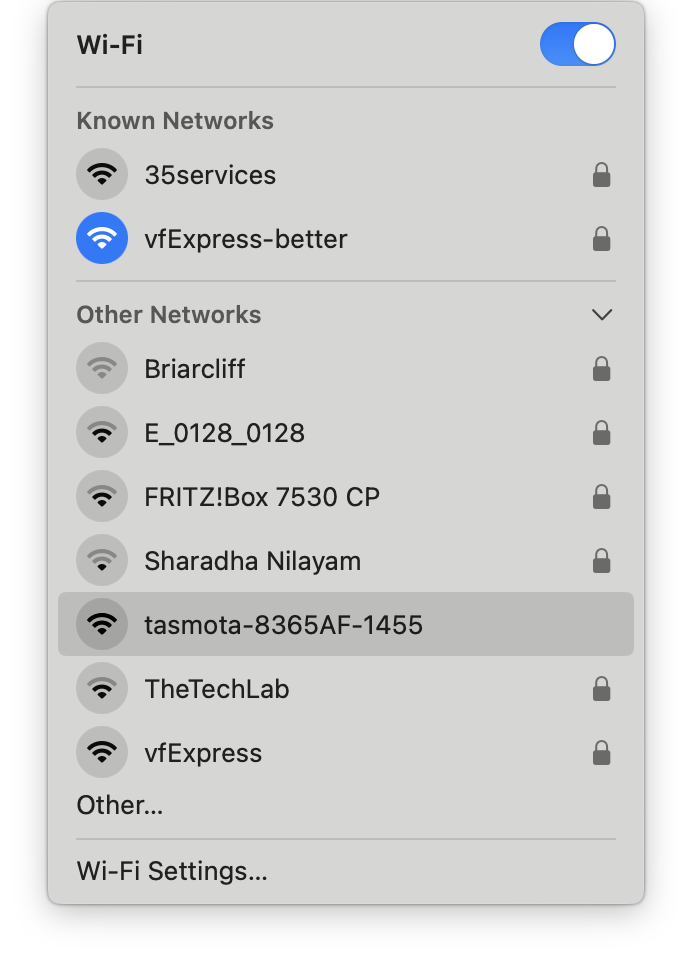

# http://192.168.178.123/ - tasmota_8365AF - `001 ZUSE`
```
MQTT Host	pi5-64.local
MQTT Port	1883
MQTT User	DVES_USER
MQTT Client	DVES_8365AF
MQTT Topic	tasmota_%06X
MQTT Group Topic 1	cmnd/tasmotas/
MQTT Full Topic	cmnd/tasmota_8365AF/
MQTT Fallback Topic	cmnd/DVES_8365AF_fb/
MQTT No Retain	Disabled
```

## how to connect 
* plug in
* connect to wifi:
*  
*  open [http://192.168.4.1/](http://192.168.4.1/)

